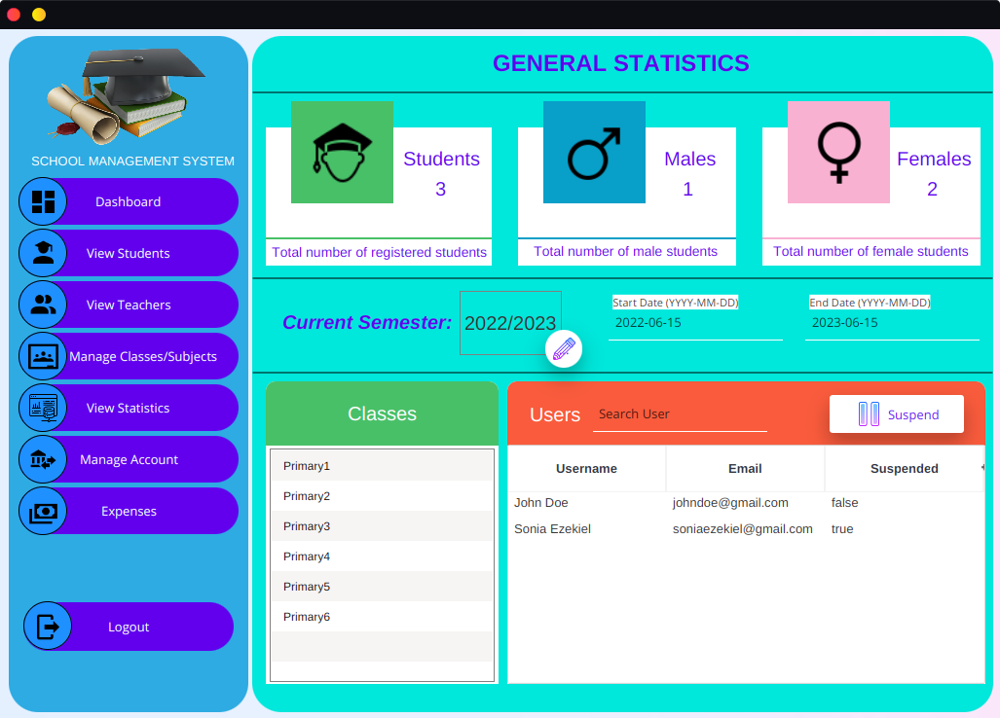
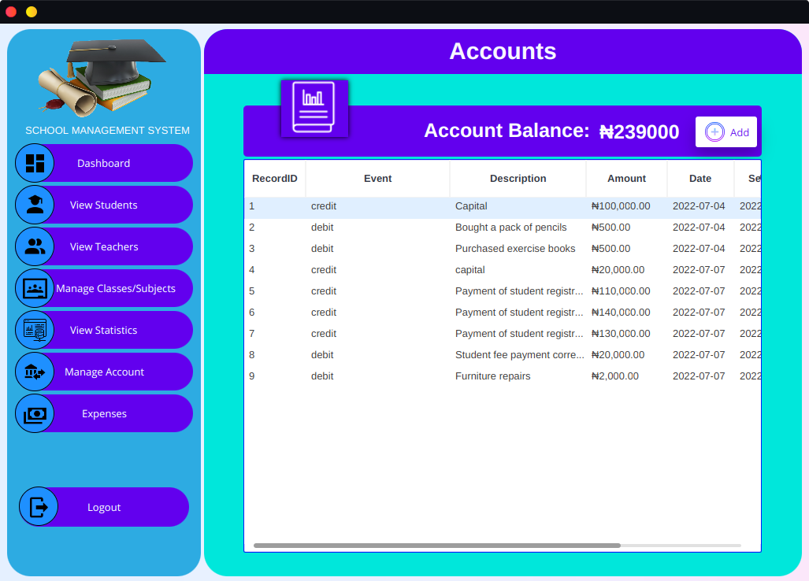
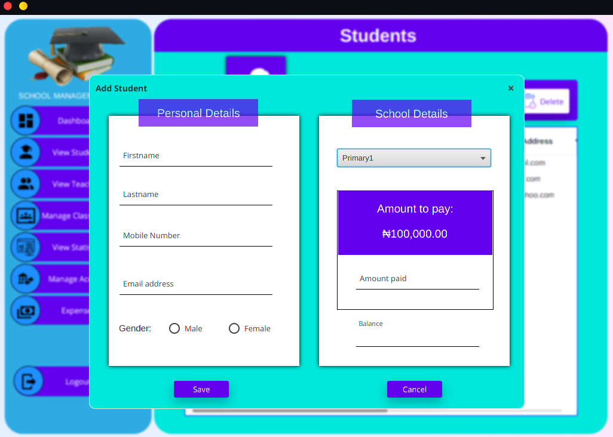

# SchoolManagement
A school management system built using JavaFX and postgresql

It was built using java11 hence javafx has to be setup on the IDE before using it.
I recommend using Intellij.
Also, a database named SchoolManagement will have to be created

# SCREENSHOTS

# Login page

# Signup page

# Dashboard

# Profile page

# Staff page

# Statistics page

# Accounts page

# Students page

# Add student dialog

# Classes page

# Expenses page

